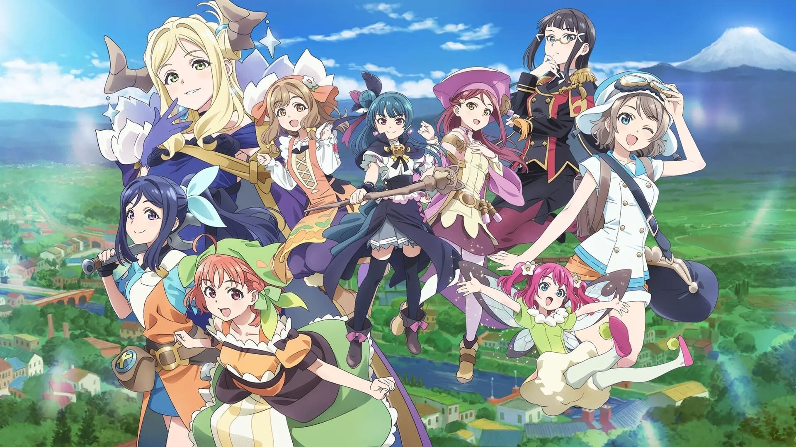
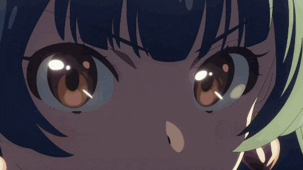

<p align="center">
  
</p>

<h1 align="center">Yohane The Parhelion! The Siren in the Mirror World!</h1>
<h2 align="center">CCROG2 - Machine Project<br></h2>

<p align="center">
  
</p>

## Overview

**Yohane the Parhelion! The Siren in the Mirror World!** is a roguelike dungeon-crawler game developed in C. In the game, the members of the idol group Aqours have lost their voices to a malevolent Siren. The player takes on the role of Yohane, who must venture into dangerous dungeons to rescue her friends and ultimately confront the Siren to restore their voices.

## Gameplay

The game blends classic roguelike mechanics with a unique theme based on the "Yohane the Parhelion" anime. Each playthrough offers a new challenge with dungeon layouts and encounters.

### Objective

A single playthrough consists of clearing three dungeons, each associated with a member of Aqours. These three dungeons are randomly selected from a pool of eight. After successfully rescuing the three members, the final dungeon unlocks, where Yohane and her companion Lailaps must face the Siren in a multi-phased boss battle.

### Controls

| Key                | Action                              |
|--------------------|-------------------------------------|
| `W`, `A`, `S`, `D` | Move Yohane (and Lailaps)           |
| `[` / `]`          | Cycle through available items       |
| `Space`            | Use the currently equipped item     |

### Dungeons

*   **Structure:** Each dungeon consists of multiple floors. The number of floors increases with the dungeon's difficulty level within a playthrough.
*   **Tiles:** The map is composed of various tiles: walls (`*`), destructible walls (`v`), water (`w`), damaging spikes (`x`), heat tiles (`h`), and treasure (`T`).
*   **Enemies:** Dungeons are populated with bats (`b`) that pursue and attack the player. Defeating them can yield gold (`g`).
*   **Progression:** Find the exit (`E`) on each floor to advance. Clearing the final floor of a dungeon rescues the associated Aqours member.

### The Final Battle

The confrontation with the Siren is a unique, multi-stage encounter:
1.  **Switch Phase:** Yohane and Lailaps must simultaneously stand on two switches to progress through phases. New switches spawn in each phase.
2.  **Barrier Phase:** After activating all switches, the barrier protecting the Siren is lowered.
3.  **Combat Phase:** The Siren becomes active and will hunt down whichever is closer: Yohane or Lailaps. The player must defeat the Siren to win the playthrough.

### Items & Shop

Players can collect gold (`g`) from treasures and defeated enemies. This gold can be spent at Hanamaru's Shop (unlocked after rescuing her) for valuable items and permanent upgrades:

*   **Consumables:** Heal HP or provide life-saving effects (e.g., Tears of a Fallen Angel, Noppo Bread, Choco-Mint Ice Cream).
*   **Permanent Upgrades:** Enhance Yohane's abilities, such as the Shovel Upgrade (negates damage from spike walls), Bat Tamer (reduces bat damage), Air Shoes (walk on water & negates damage from heat tiles), and Stewshine / Mikan Mochi / Kurosawa Macha (increases HP by 1 permanently).

## Features

*   **Roguelike System:** Dungeons are randomly generated for each playthrough, ensuring high replayability.
*   **Persistent Progression:** Cleared dungeons and unlocked achievements are saved permanently. Rescuing Aqours members unlocks new, powerful items in the shop for future runs.
*   **Achievement System:** Track your progress with 28 unique achievements, from rescuing members for the first time to completing difficult challenges.
*   **Save System:** Player progress, including current playthroughs and permanent unlocks, is saved to a `.bin` file, allowing you to quit and resume later.

## How to Compile and Run

This project is a single-file C program designed for a Windows environment, as it uses libraries like `conio.h` and the `system("chcp 65001")` command for console manipulation and character encoding.

### Prerequisites

*   A C compiler that supports the C99 standard and Windows-specific libraries. [MinGW-w64](https://www.mingw-w64.org/) is recommended.

### Compilation

1.  Open a command prompt or terminal in the project's root directory.
2.  Compile `yohane.c` using GCC:
    ```sh
    gcc -Wall -std=c99 yohane.c -o yohane.exe
    ```

### Running the Game

Execute the compiled program from your terminal:

```sh
yohane.exe
```

The game will prompt for a player name, which will be used to create or load a `.bin` save file in the same directory.

## File Structure

```
.
├── yohane.c                  # Main source code containing all game logic
├── finalMap/
│   └── finalDungeon.txt      # Layout for the final Siren boss battle map
└── maps/
    ├── awashima_marine_park.txt    # Map files for the 8 different dungeons,
    ├── izu_mito_sea_paradise.txt   # each associated with an Aqours member
    ├── ...
```

## Acknowledgements
*   **Stack Overflow**: For guidance on `math.h`.
*   **W3Schools**: For `atan2()` function usage.
*   **Study.com**: For the mathematical concepts applied to the Siren's behavior.
*   **Playtesters**: For their valuable feedback during development.
